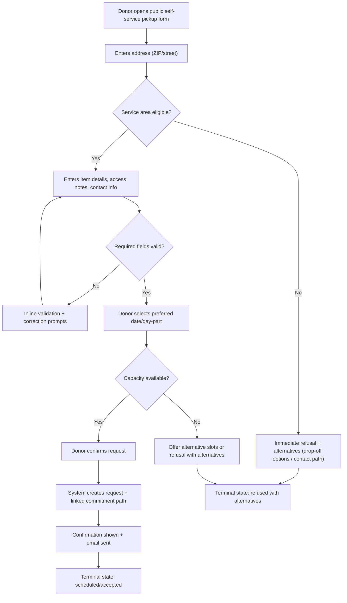
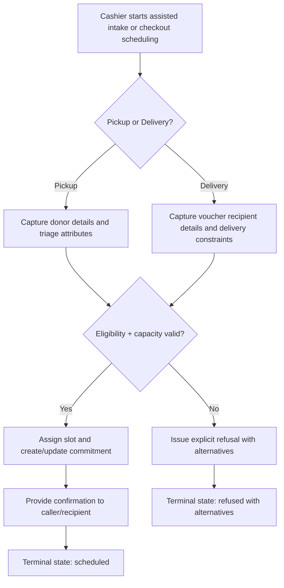
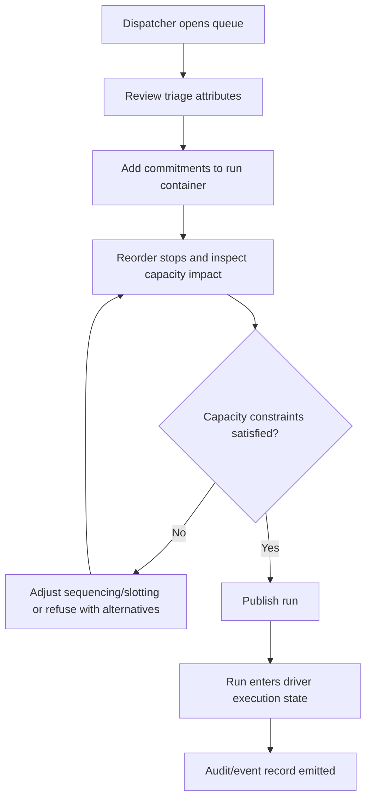
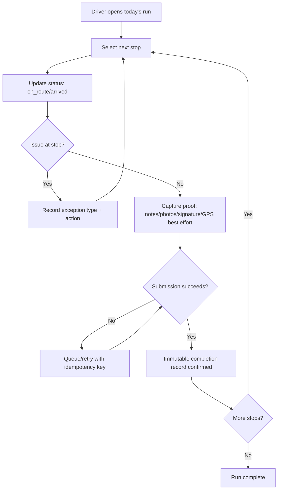

# UX Design Specification Shyft

**Author:** Jeremiah
**Date:** 2026-02-17

---

<!-- UX design content will be appended sequentially through collaborative workflow steps -->

## Executive Summary

### Project Vision

Shyft is a commitment-management platform for nonprofit execution workflows. UX must enforce reliable follow-through across donor pickups, cashier-assisted intake/scheduling, dispatcher planning, and driver proof capture. The product's UX center is execution discipline with dignity constraints, not request throughput for its own sake.

### Target Users

Primary users:
- Frontline operators (dispatchers/program coordinators)
- Cashier/front-end staff (phone-assisted donor intake + voucher delivery scheduling)
- Field executors (drivers, pickup-dominant day with occasional deliveries)
- Furniture donors (public pickup form users)

Secondary users:
- Program leadership (operational visibility)
- Funders (aggregate, non-extractive reporting only)

### Key Design Challenges

- Designing pickup-first scheduling UX where delivery is a constrained exception.
- Supporting two intake modes with consistent outcomes: public donor self-service and cashier-assisted entry.
- Enforcing explicit commitment lifecycle transitions to prevent silent drop-offs.
- Keeping dispatcher and driver workflows fast under operational stress while preserving proof integrity.
- Embedding multi-tenant/module entitlements and role boundaries without role confusion in UI.

### Design Opportunities

- Make commitment state and next action unmistakably clear in every role-specific surface.
- Use refusal UX as trust infrastructure (explicit alternatives, never dead-ends).
- Reduce frontline cognitive load with run-building UX that visualizes capacity impact before publish.
- Create a mobile driver flow optimized for short, high-confidence completion loops.
- Deliver dignity-safe reporting UX that is operationally useful without individual surveillance framing.

## Core User Experience

### Defining Experience

The core loop is commitment execution with no ambiguity: create or receive a commitment, validate capacity, assign ownership, execute, and close with immutable proof. The most critical interaction to get right is dispatcher scheduling and publish flow, because it determines whether commitments are realistic and trusted before the day starts.

### Platform Strategy

Primary platforms:
- Web app for dispatchers, cashier/front-end staff, and leadership
- Mobile-first web experience for drivers (touch-first, low-friction, high-clarity)
- Public web form for furniture donors

Interaction strategy:
- Dispatcher/cashier: keyboard-efficient workflows with rapid data entry and queue triage.
- Driver: touch-optimized status/proof actions with large targets and minimal navigation depth.
- Donor: short, guided form with explicit acceptance/refusal outcomes and alternatives.

Constraints:
- Multi-tenant/module-role access must shape visible actions and data.
- CSRF/session/auth boundaries must be invisible to users but strict in behavior.
- Offline/weak-connectivity execution must avoid duplicate completion side effects.

### Effortless Interactions

- One-path scheduling: capacity check is embedded in scheduling flow, not a separate screen.
- One-tap status progression for drivers (`en_route`, `arrived`, `completed`) with clear recovery when submission fails.
- Refusal handling as first-class flow: structured alternatives are part of refusal, never an afterthought.
- Cashier-assisted entry mirrors public donor flow so outcomes and state logic are identical.
- Commitment detail views always show current state, owner, next required action, and blockers.

### Critical Success Moments

- Dispatcher publishes a run with confidence because capacity impacts and conflicts are visible before publish.
- Driver completes a stop once and immediately sees durable proof accepted.
- Donor receives a definitive outcome (scheduled or refusal with alternatives) without uncertainty.
- Cashier schedules a voucher-recipient delivery at checkout without side-channel coordination.
- Leadership can verify terminal-state coverage and identify exceptions without reading narratives.

### Experience Principles

- Commitment clarity over interface novelty: every screen must answer “what was promised, what is next, who owns it?”
- Explicit outcomes over implied state: no silent transitions, no hidden refusals, no dead ends.
- Pickup-first operational truth: donation pickup is default planning model; delivery is constrained insertion.
- Cognitive load minimization for frontline roles: speed, scannability, and decisive action over dense dashboards.
- Dignity-safe visibility: operational signal is high while person-level surveillance is constrained.

## Desired Emotional Response

### Primary Emotional Goals

- Frontline operators feel in control, not overloaded.
- Cashier/front-end staff feel confident entering requests/schedules on behalf of others.
- Drivers feel clarity and momentum throughout the day.
- Donors feel respected and informed, even when refused.
- Leadership feels trust in the data without relying on narrative reconstruction.

### Emotional Journey Mapping

- First contact (donor/public or cashier-assisted): users feel guided and not judged.
- Scheduling/dispatch decisions: users feel certainty because constraints are explicit.
- Field execution: drivers feel focused and unambiguous about next action.
- Completion/refusal outcomes: users feel closure because every path ends explicitly.
- Return usage: staff feel reliability and reduced cognitive strain day over day.

### Micro-Emotions

- Confidence over confusion (clear state + clear next action).
- Trust over skepticism (explicit refusals, explicit alternatives, auditable history).
- Calm over anxiety (capacity visibility before promise-making).
- Accomplishment over ambiguity (immutable completion confirmation).
- Respect over extraction (dignity-safe language and reporting boundaries).

### Design Implications

- Prioritize state visibility components: status, owner, blockers, next action on every operational surface.
- Use refusal UX with plain-language reasons plus alternatives, never silent or vague outcomes.
- Design interaction pacing for stress environments: high-contrast hierarchy, short action loops, minimal branching.
- Make success confirmations explicit at key transitions (scheduled, published, completed, refused).
- Ensure error and recovery patterns preserve user confidence (idempotent retries, queue/sync status, clear remediations).

### Emotional Design Principles

- Clarity is care: unclear UI is treated as operational risk.
- Explicitness builds trust: every commitment transition must be visible and reasoned.
- Respectful outcomes always: refusal is a supported path, not a dead end.
- Calm under pressure: interfaces reduce cognitive overhead during high-volume operations.
- Dignity by default: no copy, flow, or reporting pattern should frame people as compliance objects.

## UX Pattern Analysis & Inspiration

### Inspiring Products Analysis

Reference products and what to borrow:
- Linear: fast keyboard-driven triage, clean status progression, low-friction work queues.
- Uber Driver: touch-first execution loop, clear "next action" flow, strong in-motion clarity.
- Airtable: flexible operational views (grid/filter/group) that support evolving frontline workflows.
- Stripe Dashboard: high signal density without clutter, clear state and auditability framing.

Why these fit Shyft:
- They prioritize operational clarity, decisive actions, and trust-building state visibility.
- They balance speed with reliability in high-stakes workflows.

### Transferable UX Patterns

Navigation patterns:
- Queue-first home for staff roles (dispatcher/cashier), with role-tailored filters.
- Day-plan primary view for drivers with minimal branching.
- Sticky context headers showing commitment state, owner, and blocking conditions.

Interaction patterns:
- Command-style quick actions for dispatch (`assign`, `publish`, `refuse`, `reschedule`).
- One-direction state progression with explicit reversal paths requiring reason codes.
- Inline capacity feedback before schedule confirmation (preventive, not post-failure).

Visual patterns:
- Status-first hierarchy using constrained semantic color + icon labels.
- Proof-capture checkpoint cards (notes/photos/signature/GPS) with completion confidence indicators.
- Refusal and exception actions visually equivalent in importance to "happy path" actions.

### Anti-Patterns to Avoid

- Hidden state transitions that force users to infer what happened.
- Modal-heavy, multi-step dispatch flows that block rapid triage.
- Refusal as a dead-end outcome without alternatives.
- Overly narrative data-entry burdens for frontline users during execution windows.
- Dashboard-first layouts that bury immediate operational actions under analytics chrome.

### Design Inspiration Strategy

What to adopt:
- Linear-like queue speed and keyboard ergonomics for dispatcher/cashier surfaces.
- Uber Driver-like touch-first sequencing for driver status/proof flows.
- Stripe-like state and audit clarity for trust-sensitive operations.

What to adapt:
- Airtable-style flexibility, but constrained by commitment lifecycle and role permissions.
- Command actions, but with explicit policy/tenancy guardrails and refusal semantics.

What to avoid:
- Consumer-growth style dark patterns or engagement loops.
- Visual novelty that weakens operational scannability.
- Any interaction that encourages shadow workflows outside the system.

## Design System Foundation

### 1.1 Design System Choice

Themeable system with utility-first foundation:
- Tailwind CSS + Headless UI primitives + internal Shyft component layer
- Supplement with selective Radix primitives for complex accessible controls (dialogs, popovers, menus)

This is a hybrid "themeable system" approach, not a fully custom-from-scratch system and not a rigid off-the-shelf visual kit.

### Rationale for Selection

- Supports speed for brownfield rollout while preserving strong customization.
- Fits multi-surface needs (dispatcher desktop, cashier desktop, donor web form, driver mobile web).
- Enables strict consistency for commitment-state semantics across modules.
- Keeps accessibility and interaction primitives reliable without locking visual identity to a generic enterprise style.
- Aligns with monolith governance model: one shared token/component spine across modules.

### Implementation Approach

- Define platform-wide design tokens first:
  - Color semantics: `status_scheduled`, `status_in_progress`, `status_completed`, `status_refused`, `status_blocked`
  - Typography scale optimized for operational scannability
  - Spacing/radius/shadow scale for dense-but-readable workflows
- Build core component set in this order:
  1. State chips/badges
  2. Queue table/list rows
  3. Action bars (dispatch/cashier)
  4. Form primitives (donor + assisted intake)
  5. Driver mobile action cards
- Enforce role-aware UI gates in component usage (entitlement-aware action visibility).
- Include motion constraints (`prefers-reduced-motion`) and high-contrast compliance in base layer.

### Customization Strategy

- Brand expression should be achieved through tokens and layout rhythm, not ad hoc per-screen styling.
- Keep "operational semantics" immutable:
  - State color/label mapping must remain consistent across modules.
  - Refusal and exception actions must retain first-class visual priority.
- Create variant contracts by surface:
  - `desktop-ops` (dispatcher/cashier)
  - `mobile-field` (driver)
  - `public-intake` (donor)
- Add a governance checklist so new components cannot bypass accessibility, state clarity, and dignity-safe copy rules.

## 2. Core User Experience

### 2.1 Defining Experience

The defining Shyft interaction is commitment slotting and execution closure:
- A commitment enters the queue.
- A staff user schedules or refuses it with explicit alternatives.
- A dispatcher publishes it into a run with visible capacity impact.
- A driver closes it with immutable proof.
- The system enforces terminal-state completion with no silent drop-offs.

If this single loop feels clear, fast, and trustworthy, the rest of the product compounds in value.

### 2.2 User Mental Model

What users think:
- Dispatchers/cashiers think in promises and constraints, not abstract tickets.
- Drivers think in "what's next right now," not back-office data structures.
- Donors think in "Will someone come, and when?" not lifecycle diagrams.

Current workaround model:
- Whiteboards, text chains, memory, and ad hoc spreadsheets.
- Success depends on specific people remembering details.

Expected model in Shyft:
- One visible source of truth per commitment.
- Clear owner + clear next action + clear outcome path.
- Refusal is explicit and respected, not hidden or delayed.

### 2.3 Success Criteria

Users say "this just works" when:
- They can schedule or refuse in one deterministic flow.
- Capacity constraints are shown before commitment is made.
- Run publish happens without hidden conflicts.
- Drivers can complete once and trust that proof is durable.
- Every commitment has a visible terminal state.

Operational success indicators:
- Reduced cross-channel clarification traffic.
- Lower post-publish rework.
- Faster triage-to-slot decisions.
- No ambiguous commitment states.

### 2.4 Novel UX Patterns

Pattern posture:
- Mostly established patterns, combined in a commitment-first spine.

Established patterns used:
- Queue triage, list/detail split, state chips, inline validation, action confirmations.

Novel combination in Shyft:
- Refusal-with-alternatives treated as first-class peer to scheduling.
- Capacity-aware slotting + commitment-state clarity + immutable proof in one continuous loop.
- Pickup-first prioritization encoded directly in planner interaction design.

User education impact:
- Minimal for staff (familiar primitives), low for donors (guided intake), and low for drivers (single-track mobile flow).

### 2.5 Experience Mechanics

1. Initiation:
- Commitment appears in role-appropriate inbox/queue.
- Priority, readiness, and blocking indicators are immediately visible.

2. Interaction:
- Staff chooses schedule/refuse/reschedule using constrained actions.
- Capacity impact is computed and shown inline before confirmation.
- Dispatcher assigns/publishes through explicit state transitions.

3. Feedback:
- Immediate state change confirmation with timestamp and actor.
- Errors return actionable remediation (not generic failure).
- Duplicate submissions are safely handled with idempotent outcomes.

4. Completion:
- Driver submits proof package (notes/photos/signature/GPS best effort).
- System confirms immutable completion record.
- Commitment transitions to terminal state and becomes reportable/auditable.

## Visual Design Foundation

### Color System

Operational semantic-first palette:
- `status_scheduled`: neutral blue
- `status_in_progress`: amber/orange
- `status_completed`: green
- `status_refused`: red
- `status_blocked`: slate/charcoal accent

Role/surface accents:
- `desktop-ops` (dispatcher/cashier): high-contrast neutral base with strong status signals
- `mobile-field` (driver): simplified status contrast, large touch targets, reduced visual noise
- `public-intake` (donor): calmer, trust-forward tones with explicit outcome visibility

Semantic mapping rules:
- Color always pairs with text label/icon (never color-only status encoding).
- Refusal and exception states are equally prominent to avoid hidden-failure UX.
- Capacity warnings are visible pre-confirmation, not only post-error.

### Typography System

Tone:
- Professional, clear, calm-under-pressure.

Type stack strategy:
- Primary UI sans-serif optimized for legibility in dense operational interfaces.
- Secondary/mono usage only for IDs, timestamps, and audit metadata.

Hierarchy:
- H1/H2 reserved for page-level context.
- Section titles and action labels prioritized for scan speed.
- Body copy concise with strong label-value formatting.
- Status and next-action text receives elevated weight versus supporting metadata.

Readability rules:
- Minimum body size appropriate for prolonged desktop use.
- Driver mobile sizes tuned for one-hand outdoor readability.
- Avoid decorative typography in operational surfaces.

### Spacing & Layout Foundation

Spacing model:
- 8px base scale with 4px micro-adjustments for dense controls.

Layout principles:
- Dispatcher/cashier: information-dense, grid-assisted, keyboard-friendly.
- Driver: single-column progressive flow, large action zones.
- Donor: short-step form progression with clear section boundaries.

Structural guidelines:
- Keep state + owner + next action visible above fold in operational views.
- Action bars stay anchored and predictable.
- Tables/lists prioritize triage-critical fields; secondary metadata is collapsible.
- Use consistent card/group spacing to reduce scanning fatigue.

### Accessibility Considerations

- WCAG 2.2 AA is the baseline for all Shyft surfaces (dispatcher, cashier, driver, donor).
- Contrast, focus visibility, keyboard navigation, and target size requirements must satisfy WCAG 2.2 AA.
- Reduced-motion compliance for all transitions and feedback animations.
- 200% zoom support without loss of task completion paths.
- Error messaging must be explicit, actionable, and role-appropriate.
- Public donor flow uses clear labels, assistive descriptions, and recovery-first validation.

## Design Direction Decision

### Design Directions Explored

Eight direction concepts were explored through the design-direction showcase, with emphasis on:
- Queue-first operational dispatch surfaces
- Mobile-first driver execution loops
- Trust-forward donor intake
- Audit-strong leadership/state visibility
- Capacity-aware planning UI
- Role-tailored density and hierarchy

Primary direction clusters:
- Dense operations control (dispatcher/cashier)
- Field execution simplicity (driver)
- Public intake clarity (donor)

### Chosen Direction

Chosen approach: Hybrid Direction
- Base from Direction 1 (Operations Classic) for dispatcher/cashier speed and triage density.
- Integrate Direction 3 (Field-First Motion) for driver mobile workflow.
- Integrate Direction 6 (Public Trust Surface) for donor form clarity and explicit outcomes.
- Apply selected governance cues from Direction 4 (Audit-Strong Grid) for state lineage and policy confidence.

### Design Rationale

- Matches commitment-first product model: state clarity and next action stay primary.
- Aligns with pickup-dominant operations while preserving occasional delivery workflows.
- Balances speed and dignity: fast staff actions, explicit donor outcomes, durable driver proof loop.
- Supports multi-tenant module governance without fragmenting visual semantics.
- Reinforces trust through explicit refusal/exception visibility and auditable transitions.

### Implementation Approach

- Build shared semantic component spine first:
  - state chips, action bars, queue rows, proof cards, refusal panels
- Apply surface profiles:
  - `desktop-ops` for dispatcher/cashier
  - `mobile-field` for driver
  - `public-intake` for donor
- Keep one status language system across all profiles.
- Validate direction with scenario-based walkthroughs:
  - cashier-assisted request entry
  - dispatcher publish with capacity constraints
  - driver completion proof submission
  - donor refusal-with-alternatives path

## User Journey Flows

### Donor Self-Service Public Pickup Form

Goal:
Donor independently requests and schedules a pickup online (without staff intervention), or receives explicit refusal with alternatives.

Self-service constraints:
- No account required for donor submission.
- Capacity feedback is real-time before final confirmation.
- Refusal is explicit and never silent.
- Alternatives are always attached when refusal occurs.

### Cashier-Assisted Intake + Voucher Delivery Scheduling

Goal:
Cashier enters requests for low-tech callers and schedules voucher-recipient deliveries at checkout without side-channel work.

### Dispatcher Run Build + Publish

Goal:
Dispatcher triages queue, composes pickup-first run, and publishes only valid capacity-safe plan.

### Driver Execution + Completion Proof

Goal:
Driver moves through assigned commitments and closes each with immutable proof.

### Journey Patterns

- Explicit terminal outcomes in every flow (scheduled, completed, refused, canceled).
- Capacity validation before promise-making.
- Refusal-with-alternatives as a first-class path.
- State + owner + next action always visible at decision points.
- Idempotent recovery loops for unreliable connectivity conditions.

### Flow Optimization Principles

- Minimize branch depth for frontline operators.
- Keep highest-frequency actions one interaction away.
- Replace ambiguous failures with actionable recovery.
- Preserve momentum in mobile driver loop through progressive disclosure.
- Prioritize operational truth over decorative UI complexity.

## Component Strategy

### Design System Components

Foundation components from chosen stack (Tailwind + Headless UI + selective Radix):
- Buttons, inputs, selects, text areas, checkboxes/radios
- Dialogs, popovers, dropdowns, tabs, tooltips
- Tables/lists, cards, alerts, toasts
- Form validation states and accessible focus patterns

These cover most baseline interaction scaffolding for dispatcher, cashier, donor, and driver surfaces.

### Custom Components

### Commitment State Chip Set
Purpose: Standardized state visibility (`scheduled`, `in_progress`, `completed`, `refused`, `blocked`)
States: default, high-contrast, compact
Accessibility: text label + icon always paired, not color-only

### Capacity Impact Inline Panel
Purpose: Show slot impact before scheduling/publish confirmation
Content: remaining slots, conflict reason, alternative suggestions
States: valid, warning, blocked
Behavior: updates inline during date/day-part selection and run edits

### Refusal-With-Alternatives Panel
Purpose: Ensure explicit refusal outcome with actionable alternatives
Content: refusal reason code, alternative slots/options, escalation/contact path
States: pre-submit draft, confirmed refusal, reopened/edit
Accessibility: keyboard-complete, clear error guidance for missing required rationale

### Commitment Action Bar
Purpose: High-frequency action cluster for staff (`assign`, `publish`, `reschedule`, `refuse`)
Variants: dispatcher dense desktop, cashier assisted-entry, read-only leadership
Behavior: role-entitlement aware action visibility

### Driver Stop Card
Purpose: Mobile-first execution unit for each stop
Content: location, scope, required proof checklist, status controls
States: pending, active, exception, completed, queued-sync
Behavior: supports idempotent retry and queued submission feedback

### Completion Proof Composer
Purpose: Capture immutable completion package
Content: notes, photos, signature, GPS best effort
States: draft, validating, queued, submitted, failed-retry
Accessibility: large touch targets + clear capture requirements

### Component Implementation Strategy

- Build custom components on shared token system and semantic status language.
- Enforce role/entitlement gating at component API boundary (not per-screen ad hoc logic).
- Standardize state model props across components:
  - `status`, `owner`, `next_action`, `blocking_reason`, `audit_ref`
- Create story-driven acceptance criteria for each component:
  - keyboard behavior
  - focus order
  - error recovery
  - WCAG 2.2 AA checks
- Keep donor-facing variants simplified while preserving same underlying lifecycle semantics.

### Implementation Roadmap

Phase 1 (critical path):
1. Commitment State Chip Set
2. Capacity Impact Inline Panel
3. Commitment Action Bar
4. Driver Stop Card

Phase 2 (workflow integrity):
5. Refusal-With-Alternatives Panel
6. Completion Proof Composer

Phase 3 (quality hardening):
7. Cross-surface audit/lineage visual helpers
8. Advanced empty/error/loading states
9. Pattern library examples for tenant/module role variants

## UX Consistency Patterns

### Button Hierarchy

Primary actions:
- Used for irreversible/critical forward actions (`Publish Run`, `Confirm Schedule`, `Submit Completion`).
- One primary action per context region.

Secondary actions:
- Supporting actions (`Save Draft`, `Reschedule`, `Assign Later`).

Tertiary/text actions:
- Low-priority utilities (`View Audit`, `Expand Details`).

Danger actions:
- Refusal/cancel actions require explicit reason capture and confirmation where required.
- Visual priority must still keep refusal discoverable (never hidden under overflow menus in core flows).

### Feedback Patterns

Success:
- Immediate confirmation with state update, actor, and timestamp where operationally relevant.

Warning:
- Capacity and validation warnings shown inline before submission.

Error:
- Actionable error copy: what failed, why, and next corrective step.
- Never generic “Something went wrong” without remediation path.

Info:
- Context hints for triage fields, proof requirements, and policy constraints.

Sync/queue feedback:
- For driver flows, explicit `queued`, `retrying`, `synced` indicators tied to idempotent submission behavior.

### Form Patterns

Validation:
- Real-time inline validation for required fields, plus summary for blocked submissions.
- Donor self-service form prioritizes progressive disclosure and plain language.

Field behavior:
- Keep triage-critical fields grouped and ordered by decision impact.
- Use sensible defaults for high-frequency staff workflows.

Refusal flow:
- Refusal requires reason code + alternatives payload before completion.

Assisted-entry parity:
- Cashier-assisted request forms must map to same underlying lifecycle logic as donor self-service.

### Navigation Patterns

Dispatcher/cashier:
- Queue-first navigation with stable filter/sort model.
- List-detail layout with persistent action bar.

Driver:
- Day-run single-stack flow with next-stop emphasis and minimal branch depth.

Donor:
- Linear step progression with clear completion/refusal endpoints.

Leadership:
- Oversight views separate from execution actions to prevent accidental operational edits.

### Additional Patterns

Modal/overlay:
- Only for focused, high-risk decisions (publish confirmation, refusal confirmation).
- Avoid modal stacking in high-frequency tasks.

Empty states:
- Must explain why empty and what action to take next.

Loading states:
- Skeletons for list/table views; explicit progress for proof upload/sync.

Search/filter:
- Persisted filter context for staff to reduce repeat setup friction.
- Clear reset and scoped results count.

Pattern governance:
- All patterns must meet WCAG 2.2 AA baseline.
- Status semantics and refusal visibility are non-negotiable cross-surface invariants.

## Responsive Design & Accessibility

### Responsive Strategy

Desktop (`desktop-ops`):
- High-density list-detail layouts for dispatcher/cashier productivity.
- Persistent filter/action regions and keyboard-first interaction model.
- Side-by-side context (queue + detail + action bar) where space permits.

Tablet:
- Simplified two-pane layouts for operational review and assisted-entry usage.
- Larger touch targets and reduced concurrent panel complexity.
- Preserve key actions without requiring hover-dependent interactions.

Mobile (`mobile-field` + donor form):
- Driver: single-column, next-action-first flow with sticky primary actions.
- Donor: stepwise form progression with concise sections and explicit outcome screens.
- Keep critical state and errors immediately visible without deep scrolling.

### Breakpoint Strategy

Mobile-first breakpoints:
- `sm`: 320-639px (small phones)
- `md`: 640-767px (large phones)
- `lg`: 768-1023px (tablet)
- `xl`: 1024-1439px (desktop)
- `2xl`: 1440px+ (wide operations screens)

Behavior rules:
- No functional loss across breakpoints.
- Complexity increases with viewport, but lifecycle/state semantics remain identical.

### Accessibility Strategy

Compliance baseline:
- WCAG 2.2 AA throughout all Shyft surfaces.

Core requirements:
- Keyboard-operable workflows for all critical staff actions.
- Visible focus indicators and logical tab order.
- Non-color-only state communication.
- Target sizes and spacing suitable for touch and motor accessibility.
- Form labels, instructions, and errors explicitly programmatically associated.
- Reduced-motion support and predictable interaction transitions.

Role-specific accessibility emphasis:
- Dispatcher/cashier: speed + keyboard + focus persistence.
- Driver: touch clarity, high contrast outdoors, low cognitive interruption.
- Donor: plain language, clear recovery paths, no hidden validation traps.

### Testing Strategy

Responsive testing:
- Manual testing on representative phone/tablet/desktop devices.
- Cross-browser verification (Chrome, Safari, Firefox, Edge).
- Orientation and viewport edge-case checks for driver and donor flows.

Accessibility testing:
- Automated checks (axe/Lighthouse) in CI.
- Keyboard-only walkthroughs for critical journeys.
- Screen-reader spot checks (VoiceOver/NVDA).
- Contrast and zoom validation (including 200% zoom scenarios).

Workflow test set:
- Donor self-service schedule/refusal path.
- Cashier-assisted entry + delivery scheduling path.
- Dispatcher publish with capacity block/recovery.
- Driver completion + queued sync/retry behavior.

### Implementation Guidelines

- Build mobile-first styles, then progressively enhance for larger screens.
- Keep state + next action above fold where possible in operational surfaces.
- Treat refusal and exception paths as first-class in layout and interaction.
- Centralize status semantics and feedback patterns in component layer.
- Enforce accessibility acceptance criteria in component definitions and PR checks.
