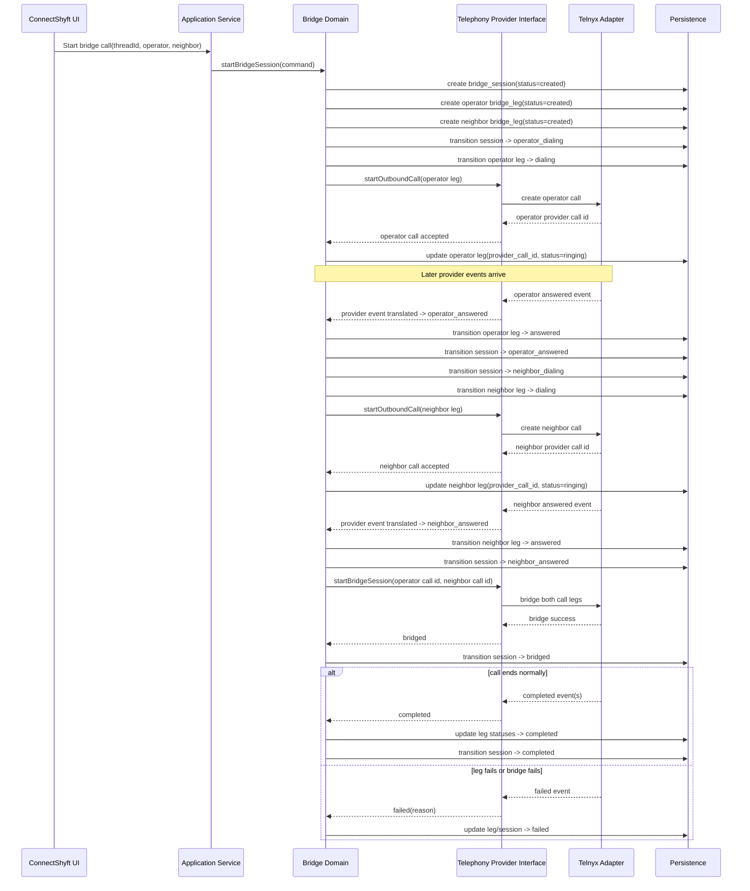

# CS-004 Bridge Flow Sequence Diagram

This diagram is the reference flow for `CS-004_Call_Bridge_Guardrailed_Spec.md`.

It shows the intended orchestration boundary:

- UI triggers an action
- application service starts the bridge session
- bridge domain owns state transitions
- telephony provider interface is used
- Telnyx remains behind the adapter boundary

## Mermaid Sequence Diagram

## Non-Negotiable Notes

- The UI is not the source of truth.
- The bridge domain owns the session and leg state.
- The bridge domain must not import raw Telnyx payload types.
- Provider events must be translated before entering the bridge domain.
- Session state must persist outside frontend state.
