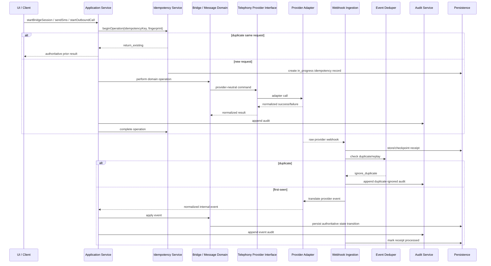

# CS-005 Reliability Sequence Diagram

```mermaid
sequenceDiagram
    participant UI as UI / Client
    participant APP as Application Service
    participant IDEMP as Idempotency Service
    participant DOMAIN as Bridge / Message Domain
    participant TELE as Telephony Provider Interface
    participant INFRA as Provider Adapter
    participant WEBHOOK as Webhook Ingestion
    participant DEDUPE as Event Deduper
    participant AUDIT as Audit Service
    participant DB as Persistence

    UI->>APP: startBridgeSession / sendSms / startOutboundCall
    APP->>IDEMP: beginOperation(idempotencyKey, fingerprint)

    alt duplicate same request
        IDEMP-->>APP: return_existing
        APP-->>UI: authoritative prior result
    else new request
        IDEMP->>DB: create in_progress idempotency record
        APP->>DOMAIN: perform domain operation
        DOMAIN->>TELE: provider-neutral command
        TELE->>INFRA: adapter call
        INFRA-->>TELE: normalized success/failure
        TELE-->>DOMAIN: normalized result
        APP->>AUDIT: append audit
        APP->>IDEMP: complete operation
    end

    INFRA-->>WEBHOOK: raw provider webhook
    WEBHOOK->>DB: store/checkpoint receipt
    WEBHOOK->>DEDUPE: check duplicate/replay

    alt duplicate
        DEDUPE-->>WEBHOOK: ignore_duplicate
        WEBHOOK->>AUDIT: append duplicate-ignored audit
    else first-seen
        WEBHOOK->>INFRA: translate provider event
        INFRA-->>APP: normalized internal event
        APP->>DOMAIN: apply event
        DOMAIN->>DB: persist authoritative state transition
        APP->>AUDIT: append event audit
        WEBHOOK->>DB: mark receipt processed
    end
```

Non-negotiable:
- idempotency before side effects
- duplicate detection before event application
- audit append-only
- retry logic cannot bypass domain rules
